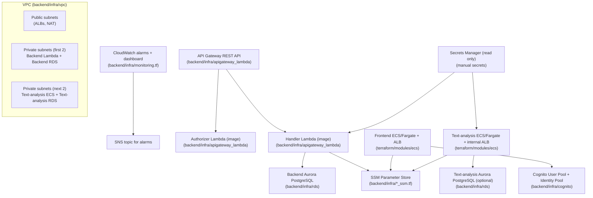

# ISPAI Terraform Infrastructure Guide

This repository uses Terraform to provision AWS infrastructure for the ISPAI application. The Terraform is split into **stacks** (separate Terraform working directories with their own state) and **modules** (reusable building blocks).

If you read only one thing first: start with `backend/infra/main.tf` and `frontend/infra/main.tf` — those two files describe almost everything that is actively created today.

---

## What gets created (high-level)

**Backend stack (`backend/infra/`)**
- Networking: VPC, public/private subnets, IGW, NAT gateway(s), route tables.
- Database: Aurora PostgreSQL Serverless v2 (RDS cluster + instance) for backend; optional separate RDS for text-analysis.
- Auth: Cognito User Pool + Identity Pool, with Okta SAML IdP integration.
- API: API Gateway (REST) that proxies to a **container-image Lambda** handler; plus a custom authorizer Lambda.
- Compute:
  - Backend API runs in Lambda (container image from ECR).
  - Text-analysis runs in ECS/Fargate behind an internal ALB (container image from ECR) and can also define a migrations task.
  - Frontend webapp can also run in ECS/Fargate behind an ALB (container image from ECR).
- Ops: CloudWatch alarms + an overview dashboard + SNS topic for alarm notifications.
- Config:
  - Secrets Manager: Terraform **reads** application secrets (created manually).
  - SSM Parameter Store: Terraform creates **placeholder parameters** (many default to `CHANGE_ME`) so deployments don’t fail; values are meant to be updated later without Terraform overwriting them.

**Frontend stack (`frontend/infra/`)**
- S3 buckets:
  - assets bucket (for static assets)
  - audio-files bucket
  - transcoded bucket
- CloudFront distribution in front of the assets bucket, using Origin Access Control (OAC).
- Bucket policy to allow CloudFront to read the assets bucket.
- A CloudWatch alarm for CloudFront 5xx errors + SNS topic for notifications.

**Legacy text-analysis stack (`text_analysis/infra/`)**
- This is mostly a “state migration” stack: it contains `removed {}` blocks to stop Terraform managing resources that are now managed by `backend/infra/`.

---

## Repo layout (Terraform)

### Stacks (Terraform working directories)
- `backend/infra/` — main “application backend” stack (also deploys ECS services).
- `frontend/infra/` — static hosting (S3 + CloudFront) stack.
- `text_analysis/infra/` — legacy/migration-only stack.

### Shared modules (reused by stacks)
- `terraform/modules/ecr/` — ECR repository + lifecycle policy.
- `terraform/modules/ecs/` — ECS/Fargate service + ALB + autoscaling + IAM + logs (+ optional migrations task).
- `terraform/modules/s3/` — S3 bucket + CORS + ownership controls + public-access block.

---

## Terraform state & environments (backend configs)

Terraform state is stored in S3 and configured via per-environment `state_store.tf` files. These files are **only read at `terraform init` time**.

Backend stack:
- `backend/infra/config/dev/state_store.tf`
- `backend/infra/config/labs/state_store.tf`
- `backend/infra/config/preview/state_store.tf`
- `backend/infra/config/prod/state_store.tf`
- `backend/infra/config/qa/state_store.tf`
- `backend/infra/config/c1prod/state_store.tf`

Frontend stack:
- `frontend/infra/config/dev/state_store.tf`
- `frontend/infra/config/labs/state_store.tf`
- `frontend/infra/config/preview/state_store.tf`
- `frontend/infra/config/prod/state_store.tf`
- `frontend/infra/config/qa/state_store.tf`
- `frontend/infra/config/c1prod/state_store.tf`

Legacy text-analysis stack:
- `text_analysis/infra/config/dev/state_store.tf`
- `text_analysis/infra/config/preview/state_store.tf`
- `text_analysis/infra/config/prod/state_store.tf`
- `text_analysis/infra/config/qa/state_store.tf`
- `text_analysis/infra/config/c1prod/state_store.tf`

Most environments use an S3 backend in `eu-west-2` (with `assume_role`), while AWS resources themselves are typically created in `us-west-2` (configured via provider `region` variables).

Examples:
- `backend/infra/config/dev/state_store.tf` → S3 backend `elttechnology`, key `ispai-NonPrd/dev/state` (assumed role).
- `frontend/infra/config/dev/state_store.tf` → S3 backend `elttechnology`, key `ispai-NonPrd/frontend:dev/state` (assumed role).
- `text_analysis/infra/config/dev/state_store.tf` → separate backend bucket/key in `us-west-2` (older setup).

---

## Stack: `backend/infra/` (main application infrastructure)

### How this stack fits together

### Files in `backend/infra/` and what they do

#### Root files

- `backend/infra/main.tf`
  - Defines AWS provider + default tags + versions.
  - Reads required **Secrets Manager** secrets (created manually) for:
    - backend (`${AWS_ENVIRONMENT}/${AWS_NAME}/secrets2`)
    - text-analysis (`${AWS_ENVIRONMENT}/${AWS_NAME}/text-analysis-secrets`)
  - Creates core modules:
    - `module.cognito` (`./cognito`)
    - `module.vpc` (`./vpc`)
    - `module.rds` (`./rds`) for backend DB
    - ECR repos via `terraform/modules/ecr` (frontend/backend/authorizer/text-analysis)
    - API Gateway + Lambdas via `./apigateway_lambda`
    - EventBridge Scheduler via `./scheduler`
    - Migrations runner Lambda via `./migrations-lambda`
    - Text-analysis ECS + optional RDS via shared modules (`terraform/modules/ecs` + `./rds`)
    - Frontend ECS via shared module (`terraform/modules/ecs`)
  - Handles ownership/state migrations:
    - `removed {}` blocks keep real cloud resources but remove them from Terraform state when ownership moved (e.g., S3 buckets moved to `frontend/infra`).
    - `moved {}` blocks rename ECR resources to match the shared module’s `main` resource names.

- `backend/infra/vars.tf`
  - Defines all input variables for this stack (VPC CIDR/subnets/AZs, DB name/user, custom domain inputs, prefixes, etc.).
  - Defines logic for picking image tags:
    - Calls `data "external"` to run `backend/infra/scripts/get_latest_ecr_tag.sh` (AWS CLI + `jq`) to resolve latest ECR tags.
    - Falls back to `var.app_version` when no ECR tag is found.

- `backend/infra/outputs.tf`
  - Exposes shared VPC outputs and subnet slices for other stacks/services (backend vs text-analysis allocation).

- `backend/infra/monitoring.tf`
  - Creates:
    - `aws_sns_topic` for alarm notifications.
    - CloudWatch metric alarms for:
      - API Gateway (4xx, 5xx, latency)
      - Lambda (handler/authorizer errors + duration)
      - RDS (CPU, connections, freeable memory, write latency)
      - ECS (CPU/memory for frontend + text-analysis)
      - ALB unhealthy hosts (frontend + text-analysis)
      - Scheduler failed invocations
    - A CloudWatch dashboard (“ISPAI overview”) that graphs the above.

#### Configuration/parameter files (SSM)

These create SSM parameters with defaults like `CHANGE_ME` and use `lifecycle { ignore_changes = [value] }` so you can update values manually in AWS without Terraform reverting them.

- `backend/infra/shared_ssm.tf`
  - Shared SSM parameters used by multiple services (Cognito IDs/redirects, Gigya key, CORS origins, etc.) under `/scomp/${AWS_ENVIRONMENT}/shared/...`.

- `backend/infra/backend_ssm.tf`
  - Backend service parameters under `/scomp/${AWS_ENVIRONMENT}/backend/...`:
    - Azure OpenAI endpoint/deployment/key placeholders
    - DB host/name pointers (from RDS/Secrets Manager)
    - Buckets (audio/transcoded)
    - Misc app config (log level, report email, etc.)

- `backend/infra/frontend_ssm.tf`
  - Frontend app parameters under `/scomp/${AWS_ENVIRONMENT}/frontend/...`:
    - `NEXT_PUBLIC_API_URL`, `NEXT_PUBLIC_ASSET_URL_PREFIX`, etc.

- `backend/infra/text_analysis_ssm.tf`
  - Text-analysis parameters under `/scomp/${AWS_ENVIRONMENT}/text-analysis/...`:
    - Cambridge dictionary config placeholders
    - OpenTelemetry defaults
    - Conditional DB host/name parameters (only if text-analysis DB password exists)

#### Environment backend config
- `backend/infra/config/*/state_store.tf`
  - S3 backend config for the stack state (different key/role per environment).

- `backend/infra/config/*/*.tfvars`
  - Environment-specific values for core variables (name, env, region, CIDR, subnets, DB name/user).
  - Present in this repo for: `prod`, `preview`, `c1prod`.

---

## Modules under `backend/infra/` (used by the backend stack)

### Module: Cognito (`backend/infra/cognito/`)

- `backend/infra/cognito/main.tf`
  - Creates Cognito User Pool (email login, custom attributes like `class_name` and `institution_name`).
  - Creates an Okta SAML Identity Provider (provider details include environment-specific metadata URL).
  - Creates User Pool Domain + User Pool Client (OAuth flows/scopes; callback/logout URLs come from locals).
  - Creates Identity Pool + IAM roles for authenticated/unauthenticated users.

- `backend/infra/cognito/locals.tf`
  - Defines environment → callback/logout base URLs.
  - Defines environment → Okta metadata URL mapping.

- `backend/infra/cognito/vars.tf`
  - Input variables for naming, OAuth configuration, SES identity ARN, email addresses, bucket names, and IAM role names.

- `backend/infra/cognito/outputs.tf`
  - Exports user pool ARN/ID and app client ID.

### Module: VPC (`backend/infra/vpc/`)

- `backend/infra/vpc/main.tf`
  - Provider version constraints for this module.

- `backend/infra/vpc/vpc.tf`
  - Creates the VPC, public and private subnets, internet gateway, route tables, NAT gateway(s).
  - Supports optional VPC peering routes.
  - Uses `lifecycle.ignore_changes` on imported resources to avoid drift updates.

- `backend/infra/vpc/vars.tf`
  - Variables for CIDR, subnets, AZs, NAT gateway mode, peering route info, and `environment` tag.

- `backend/infra/vpc/outputs.tf`
  - Exposes VPC ID/ARN and subnet IDs.

### Module: RDS (Aurora PostgreSQL) (`backend/infra/rds/`)

- `backend/infra/rds/main.tf`
  - Creates:
    - DB security group (ingress restricted to VPC CIDR)
    - DB subnet group
    - RDS cluster parameter group (family depends on major version 15 or 17)
    - Aurora PostgreSQL Serverless v2 cluster + instance
  - Contains special-case naming/lifecycle rules to support importing existing resources (notably for `dev` / text-analysis history).

- `backend/infra/rds/vars.tf`
  - Inputs for app/env naming, subnet IDs, VPC ID, ingress CIDR, availability zones, DB settings, and PostgreSQL major version.

- `backend/infra/rds/outputs.tf`
  - Exposes DB endpoint/port, cluster identifier, security group ID (endpoint/port are marked sensitive).

### Module: API Gateway + Lambdas (`backend/infra/apigateway_lambda/`)

- `backend/infra/apigateway_lambda/main.tf`
  - Provider version constraints for this module.

- `backend/infra/apigateway_lambda/apigateway.tf`
  - Creates IAM role + policies for Lambda/API Gateway:
    - CloudWatch logging
    - Read SSM params by path
    - KMS decrypt for SecureStrings
    - Secrets Manager read (pattern-based secret ARN)
    - Access to Cognito admin APIs
    - Access to S3 buckets (audio/transcoded/assets)
    - SES + Polly permissions
    - API Gateway push-to-CloudWatch-logs
  - Creates:
    - API Gateway REST API + proxy resources/methods + integrations to Lambda
    - Stage with access logging + method settings
    - Handler Lambda (container image)
    - Authorizer Lambda (container image) + API Gateway authorizer
    - Optional API Gateway custom domain + base path mapping (when custom domain inputs are provided)

- `backend/infra/apigateway_lambda/vars.tf`
  - Inputs for naming/environment/version, VPC attachment (subnet IDs + security group), image repos, bucket ARNs, Cognito pool ARN, and optional custom domain/certificate ARN.

- `backend/infra/apigateway_lambda/outputs.tf`
  - Exposes API Gateway IDs/ARNs, handler Lambda ARN/name, and custom-domain outputs (regional domain name/zone id).

### Module: EventBridge Scheduler (`backend/infra/scheduler/`)

- `backend/infra/scheduler/main.tf`
  - Creates an EventBridge Scheduler group and a schedule that invokes the handler Lambda on a `rate(5 minutes)`.
  - Sends a fixed JSON payload that hits the backend handler route `/admin/warmup_session_cleanup`.
  - Adds explicit Lambda permission so `scheduler.amazonaws.com` can invoke the function.

- `backend/infra/scheduler/vars.tf`
  - Inputs: environment/name, handler Lambda ARN + function name.

### Module: Migrations runner Lambda (`backend/infra/migrations-lambda/`)

- `backend/infra/migrations-lambda/main.tf`
  - Creates a Lambda IAM role + policies:
    - CloudWatch logs
    - Read SSM params by path
    - KMS decrypt for SecureStrings
    - VPC access + X-Ray managed policies
  - Creates a migrations Lambda (container image) attached to the VPC.

- `backend/infra/migrations-lambda/vars.tf`
  - Inputs: env/version, VPC security group + subnets, migrations image repo, and environment variables map.

### Module: Secrets Manager writer (`backend/infra/secretsmanager/`)

This module exists but is not used by the active stacks shown above (the backend stack reads secrets via `data` sources and expects them to be created manually).

- `backend/infra/secretsmanager/main.tf`
  - Creates a Secrets Manager secret and writes a JSON-encoded secret value.

- `backend/infra/secretsmanager/vars.tf`
  - Inputs: secret name and a map of key/value pairs.

- `backend/infra/secretsmanager/outputs.tf`
  - Outputs decoded secret JSON.

### Module: “Transcoder” (`backend/infra/transcoder/`)

Despite the name, this module currently configures **S3 bucket policy/versioning** for the transcoded output bucket (cross-account read access).

- `backend/infra/transcoder/main.tf`
  - Enables bucket versioning for the transcoded bucket.
  - Adds an S3 bucket policy allowing a specified external AWS account (researcher) to list/get objects.

- `backend/infra/transcoder/vars.tf`
  - Inputs: bucket IDs/ARN and naming variables (some are currently unused by resources in `main.tf`).

---

## Stack: `frontend/infra/` (S3 + CloudFront)

### Files in `frontend/infra/` and what they do

- `frontend/infra/main.tf`
  - Defines AWS provider + default tags.
  - Reads `/scomp/${AWS_ENVIRONMENT}/shared/CORS_ALLOWED_ORIGINS` from SSM unless overridden by `AWS_CORS_ALLOWED_ORIGINS`.
  - Creates S3 buckets using `terraform/modules/s3`:
    - `assets` (`${prefix}-${AWS_NAME}-assets`)
    - `audio_files` (`${prefix}-${AWS_NAME}-audio-files`)
    - `transcoded` (`${prefix}-${AWS_NAME}-transcoded`)
  - Creates a CloudFront distribution (module `./cloudfront`) pointing at the assets bucket.
  - Creates an S3 bucket policy that allows CloudFront (OAC) to read objects from the assets bucket.

- `frontend/infra/variables.tf`
  - Inputs: name/env/region, CloudFront custom domain + ACM ARN, optional CORS override, and bucket prefix.

- `frontend/infra/outputs.tf`
  - Outputs CloudFront distribution identifiers and assets bucket identifiers.

- `frontend/infra/monitoring.tf`
  - SNS topic + CloudWatch alarm for CloudFront 5xx error rate.

#### Environment backend config
- `frontend/infra/config/*/state_store.tf`
  - S3 backend config for the frontend stack state (different key/role per environment).

### Module: CloudFront (`frontend/infra/cloudfront/`)

- `frontend/infra/cloudfront/main.tf`
  - Uses AWS-managed CloudFront policies:
    - `Managed-CachingOptimized`
    - `Managed-CORS-S3Origin`
    - `Managed-CORS-With-Preflight`
  - Creates:
    - CloudFront Origin Access Control (OAC) for the assets S3 origin
    - CloudFront distribution with HTTPS redirect, compression, HTTP/2+HTTP/3
    - Optional custom domain + ACM certificate when provided

- `frontend/infra/cloudfront/variables.tf`
  - Inputs: `assets_bucket` (object from parent), plus environment/name.

- `frontend/infra/cloudfront/outputs.tf`
  - Outputs distribution ID/domain name/ARN.

### Module: VPC (`frontend/infra/vpc/`)

This module exists in the repo but is **not referenced** by `frontend/infra/main.tf` as of now. It is similar to the backend VPC module (VPC + subnets + NAT + routes).

- `frontend/infra/vpc/main.tf`
- `frontend/infra/vpc/vpc.tf`
- `frontend/infra/vpc/vars.tf`
- `frontend/infra/vpc/outputs.tf`

---

## Stack: `text_analysis/infra/` (legacy migration-only)

This stack is intentionally mostly empty. It contains `removed {}` blocks so Terraform stops managing resources that were migrated into `backend/infra/`.

- `text_analysis/infra/main.tf`
  - Declares provider requirements.
  - Contains `removed {}` blocks for former modules/resources:
    - `module.ecs`, `module.ecr`, `module.migrations_ecr`, `module.rds`, `module.vpc`
    - `aws_secretsmanager_secret.secret` + `aws_secretsmanager_secret_version.secret`
    - `random_password.rds_password`

- `text_analysis/infra/config/*/state_store.tf`
  - Backend configs for legacy state (dev uses a different bucket/key than other envs).

---

## Shared modules (`terraform/modules/`)

### ECR module (`terraform/modules/ecr/`)
- `terraform/modules/ecr/main.tf` — ECR repository + lifecycle policy (keep last N images); ignores changes to support imported repos.
- `terraform/modules/ecr/variables.tf` — repo settings (tag mutability, scan on push, retention, tags).
- `terraform/modules/ecr/outputs.tf` — repository URL/ARN/name/registry ID.

### ECS module (`terraform/modules/ecs/`)
- `terraform/modules/ecs/main.tf`
  - IAM roles for ECS task execution + task role.
  - IAM policies for logs, optional SSM parameter read, optional Secrets Manager read, optional KMS decrypt, optional X-Ray.
  - CloudWatch log group.
  - ECS task definition + ECS service (Fargate).
  - Optional migration task definition (when `enable_migrations_task = true`).
  - Application Load Balancer + security groups + listeners (external: HTTP→HTTPS redirect + HTTPS listener; internal: HTTP forward).
  - Autoscaling target + memory/cpu scaling policies.
- `terraform/modules/ecs/variables.tf` — inputs for sizing, networking, ALB mode, SSM/Secrets injection, and optional OTEL sidecar.
- `terraform/modules/ecs/outputs.tf` — cluster/service/task/ALB/log group outputs.

### S3 module (`terraform/modules/s3/`)
- `terraform/modules/s3/main.tf` — S3 bucket + ownership controls + CORS config + public-access block.
- `terraform/modules/s3/vars.tf` — inputs for bucket name/env and allowed CORS origins.
- `terraform/modules/s3/outputs.tf` — bucket id/arn/domain name outputs.

---

## Practical notes (things you’ll hit while deploying)

### 1) Manual Secrets Manager secrets are required
The backend stack reads secrets via `data "aws_secretsmanager_secret"` and expects them to already exist:
- Backend: `${AWS_ENVIRONMENT}/${AWS_NAME}/secrets2` (must include at least `username` and `password` keys if used for DB auth)
- Text-analysis: `${AWS_ENVIRONMENT}/${AWS_NAME}/text-analysis-secrets` (expected keys include `username` and `password`)

If text-analysis secret does not contain a `password`, the stack intentionally **skips creating** the text-analysis RDS module and some dependent SSM parameters.

### 2) SSM parameters are placeholders by design
Many parameters are created as `CHANGE_ME` and Terraform ignores later changes to `value`. This is intentional so teams can update sensitive values in AWS without constantly fighting Terraform diffs.

### 3) Image tag resolution uses AWS CLI + jq
`backend/infra/vars.tf` runs `backend/infra/scripts/get_latest_ecr_tag.sh` via `data "external"`. That script calls:
- `aws ecr describe-images` to find the latest pushed tag
- `jq` to parse the input and output JSON

Your CI runner (or local environment) needs AWS credentials + `aws` CLI + `jq` for that data source to work.
